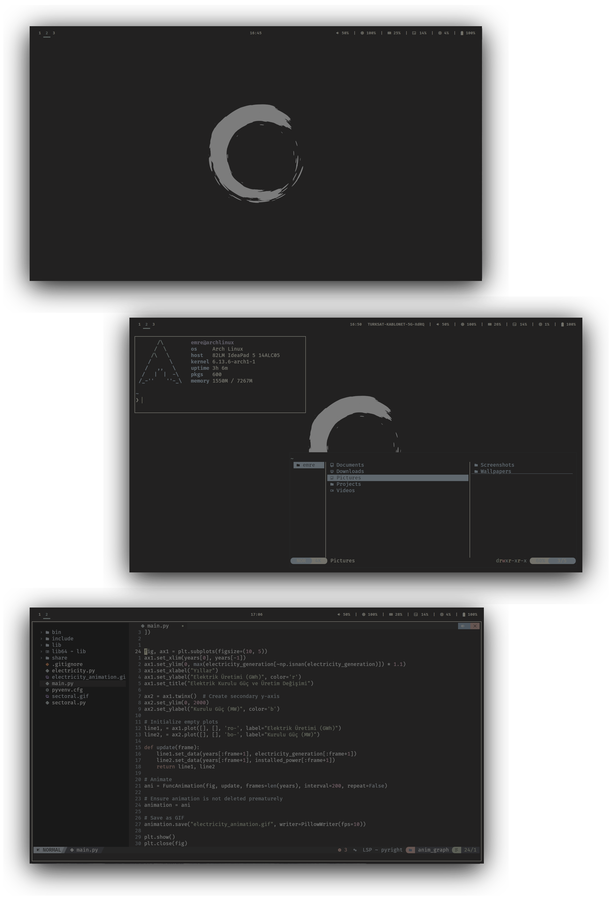

<h1 align="center">
  
</h1>

  
  
  
  

#  

  

   

#  

  

Welcome to my .dotfiles repository. This project contains my personal configuration files and installation script for Arch Linux. The goal is to provide a minimal yet fully functional workflow that’s ready for daily use, aimed at work or school. Unlike many setups, my focus isn’t on creating eye candy filled with compositors and scripts. Instead, I aim to build a truly usable workstation that doesn’t compromise on aesthetics.

Here are some details about the setup:

- **OS:** [Arch Linux](https://archlinux.org)
- **WM:** [i3](https://i3wm.org)
- **Terminal:** [kitty](https://sw.kovidgoyal.net/kitty)
- **Shell:** [zsh](https://www.zsh.org/)
- **Editor:** [neovim](https://github.com/neovim/neovim)
- **File manager:** [yazi](https://yazi-rs.github.io/)
- **Application Launcher:** [rofi](https://github.com/davatorium/rofi)
- **Colorscheme:** [kanagawa-dragon](https://github.com/rebelot/kanagawa.nvim)

Please visit [Wiki](https://github.com/emredurak01/dotfiles/wiki) to see more detailed information.

#  

  

WIP